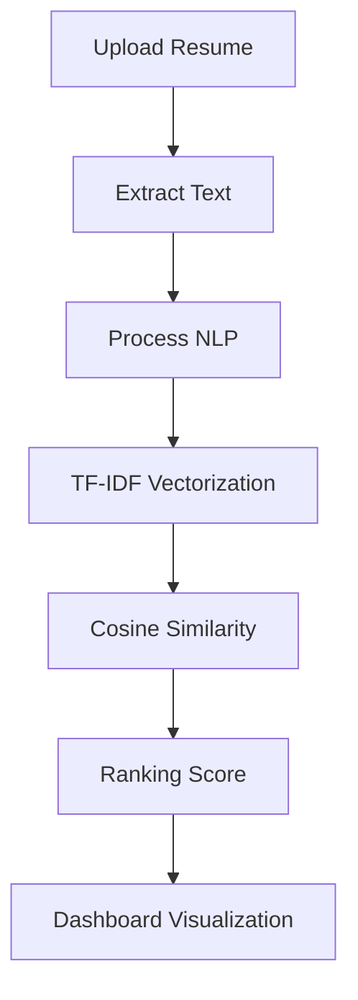

# 🤖 AI Resume Screening System


---

## 🚀 Overview

An intelligent **AI-powered Resume Screening System** that automates candidate evaluation by analyzing resumes and matching them with job descriptions using **Natural Language Processing (NLP)** and **Machine Learning techniques**.

This project simulates a **real-world Applicant Tracking System (ATS)** used by modern recruiters.

---

## ✨ Features

✅ Upload multiple resumes (PDF)
✅ Enter job description
✅ 🧠 Automatic **skill extraction**
✅ 📊 AI-based **candidate ranking**
✅ 📈 Interactive **dashboard & analytics**
✅ 🏆 Highlights top candidate
✅ 📥 Download shortlisted candidates
✅ ⚡ Real-time processing

---

## 🛠️ Tech Stack

| Category         | Technologies                             |
| ---------------- | ---------------------------------------- |
| 💻 Language      | Python                                   |
| 🎨 Frontend      | Streamlit                                |
| 🤖 ML/NLP        | Scikit-learn (TF-IDF, Cosine Similarity) |
| 📄 Parsing       | PyPDF2                                   |
| 📊 Visualization | Plotly                                   |
| 📦 Data Handling | Pandas                                   |

---

## 📂 Project Structure

```bash
resume-screening-system
│
├── app
│   └── app.py          # Main Streamlit application
│
├── src
│   ├── resume_parser.py
│   ├── skill_extractor.py
│   └── ranking_model.py
│
├── data                # Sample data
├── outputs             # Generated results
├── requirements.txt
└── README.md
```

---

## ⚙️ Installation

```bash
git clone https://github.com/your-username/resume-screening-system.git
cd resume-screening-system
pip install -r requirements.txt
```

---

## ▶️ Run the App

```bash
python -m streamlit run app/app.py
```

🌐 Open in browser:

```
http://localhost:8501
```

---

## 🧠 How It Works



---

## 📊 Output Dashboard

* 📋 Candidate Ranking Table
* 📈 Match Score Graph
* 🧠 Skills Distribution
* 🏆 Top Candidate Highlight

*(Add screenshots here for better presentation)*

---

## 🎯 Use Cases

* HR Recruitment Automation
* Resume Shortlisting
* Candidate Ranking Systems
* Hiring Analytics

---

## 🔮 Future Enhancements

🚀 AI Resume Summary using LLM
🚀 Skill gap analysis
🚀 Resume DOCX support
🚀 Database integration (MongoDB / SQL)
🚀 Cloud deployment (AWS / GCP)

---

## 👨‍💻 Author

**Chinmai J**
🎓 Computer Science Engineering Student
💡 Passionate about AI, ML & Backend Development

---

## ⭐ Show Your Support

If you like this project, give it a ⭐ on GitHub!

---

## 📜 License

This project is for educational and learning purposes.

---

# 🔥 Bonus Tip (Important)

After uploading, improve your repo by:

* Adding **screenshots**
* Adding **demo video**
* Writing **clear commits**

This will make your GitHub look **professional and recruiter-ready** 👍

---
